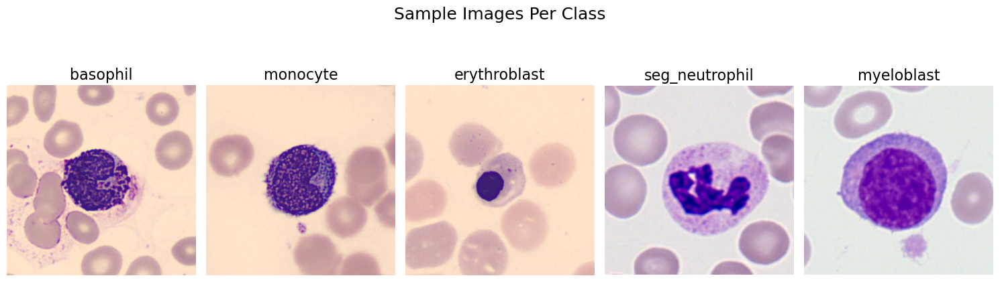
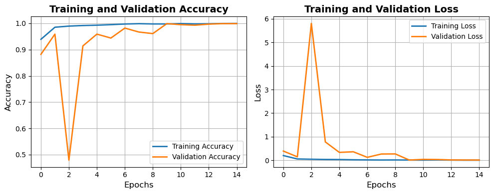

# 🧬 Blood Cell Classification using Transfer Learning and CNN

This project focuses on classifying different types of blood cells from microscopic images using Convolutional Neural Networks (CNN) and transfer learning. It combines medical imaging, deep learning, and data augmentation to achieve high classification accuracy.

---

## 📌 Problem Statement

Accurate classification of blood cell types is crucial in diagnosing various blood-related diseases, including cancer. The dataset includes 5 distinct classes:

- Basophil  
- Erythroblast  
- Monocyte  
- Myeloblast  
- Segmented Neutrophil  

Our goal is to build a robust and generalizable model capable of identifying these classes from cell images.

  

---

## 📁 Project Structure

| File | Description |
|------|-------------|
| `notebooks/1_EDA.ipynb` | Exploratory Data Analysis of the dataset |
| `notebooks/2_CNN_Model.ipynb` | Final model training with augmentation and regularization |
| `notebooks/3_Transfer_Learning.ipynb` | Base model training using MobileNetV2 |
| `models/cell_classifier_cnn_model.keras` | Saved trained model |
| `models/cell_classifier_transfer_learning.keras` | Saved trained model |
| `requirements.txt` | Python dependencies |

---

## 🔧 Technologies Used

- TensorFlow & Keras
- Transfer Learning with MobileNetV2
- Data Augmentation (rotation, zoom, flip, translation)
- Regularization (Dropout, L2)
- EarlyStopping and ReduceLROnPlateau
- Matplotlib & Seaborn for visualization

---

## 📈 Model Performance

- Validation Accuracy: ~97%  
- Training stabilized with minimal overfitting  
- Loss and accuracy curves indicate good generalization  

  

---

## 📊 Evaluation

- Confusion Matrix and Classification Report used
- Proper balance across classes ensured
- Performance monitored using validation metrics across epochs

---

## 🔗 Dataset

The dataset used is publicly available on Kaggle:  
📎 [Blood Cell Images for Cancer Detection](https://www.kaggle.com/datasets/sumithsingh/blood-cell-images-for-cancer-detection)

---

## 🚀 Setup Instructions

# Clone the repository
git clone https://github.com/YigitYildiz0623/blood-cell-classification.git
cd blood-cell-classification

# Install required packages
pip install -r requirements.txt

# Open the notebooks
jupyter [notebook]

---

## 🎯 Goals Achieved

- Built a transfer learning model with high accuracy
- Enhanced performance with augmentation and regularization
- Documented results and explained each phase via markdowns

---

## 🙋‍♂️ Author
Yiğit Yıldız
📧 Contact: [Your Email]
🔗 [LinkedIn](https://www.linkedin.com/in/yi%C4%9Fit-y%C4%B1ld%C4%B1z-490ab91b1/)
💼 Open to internships and AI research opportunities!

---

## ⭐ Acknowledgments
- Kaggle dataset provider
- TensorFlow documentation
- The open-source community